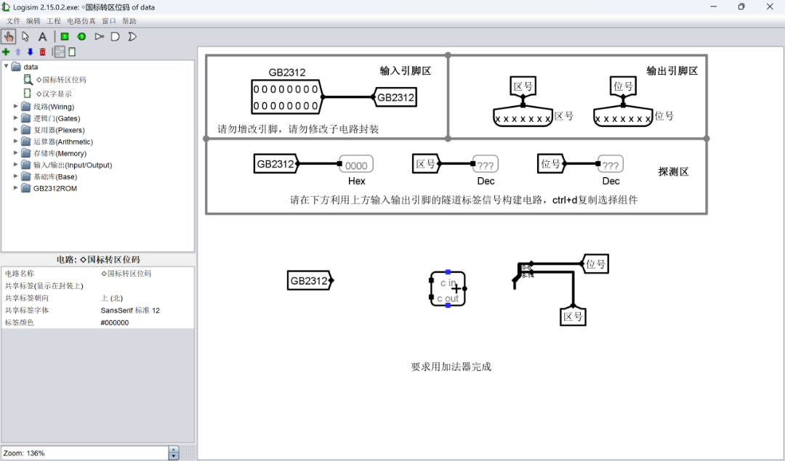
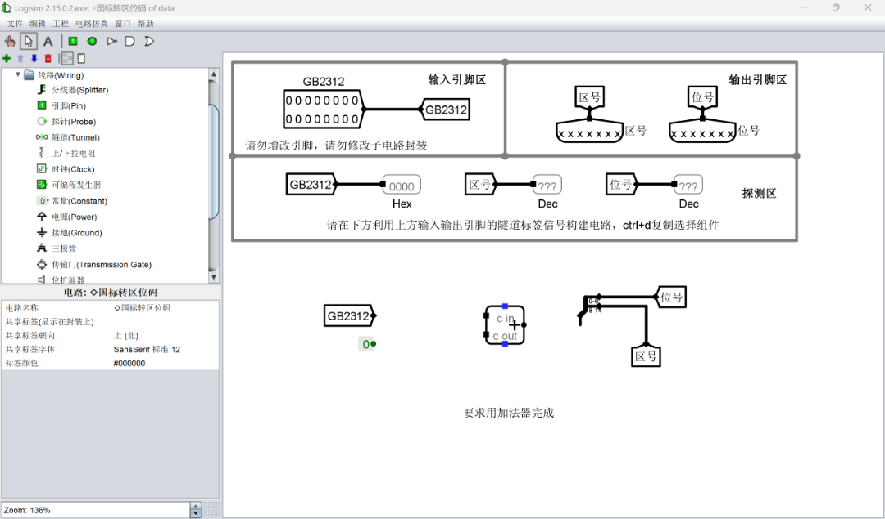
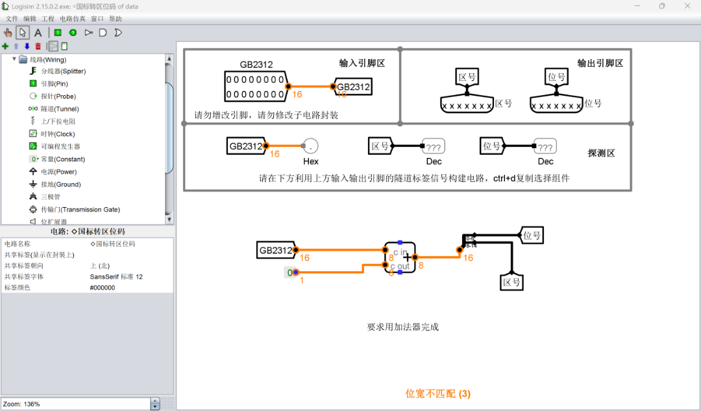
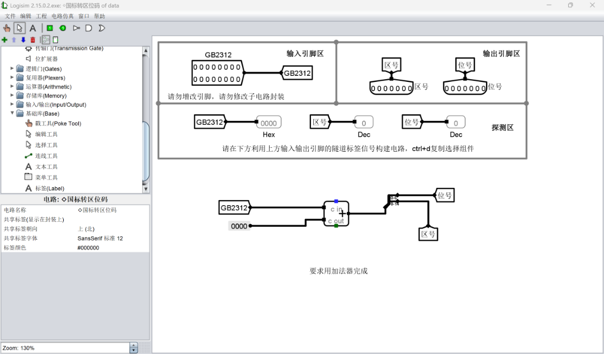
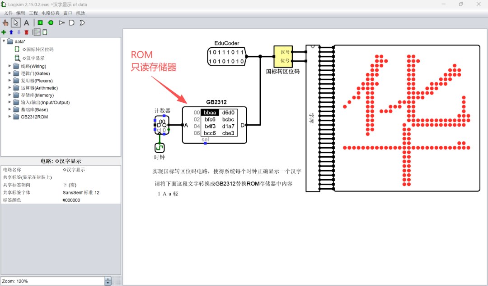
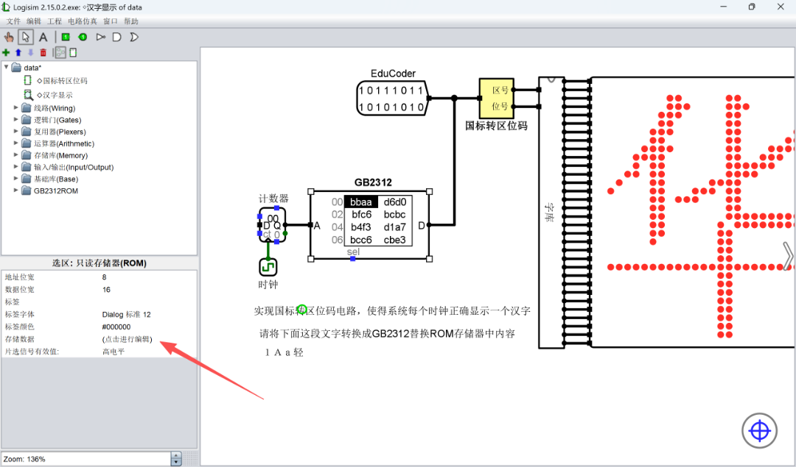
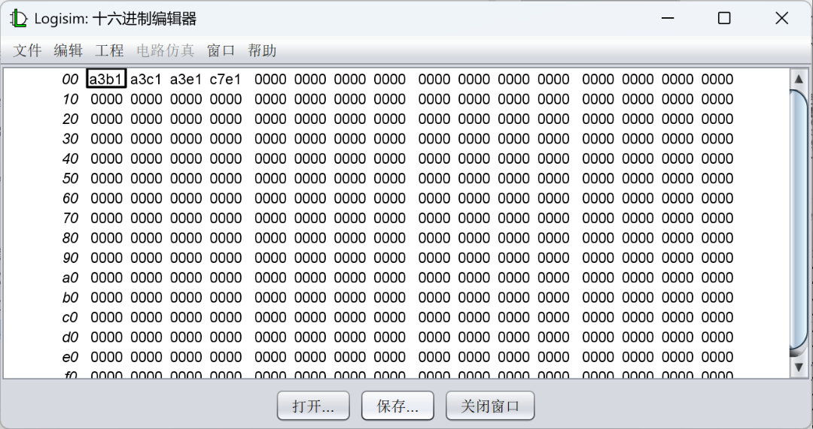
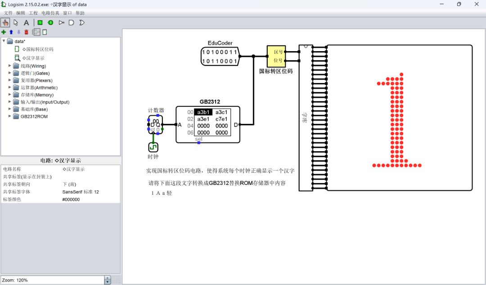

> 由于题目说明与教材都过于语焉不详，特写一文记录分享我个人的解题思路，希望能对读者起到一定量的帮助，也欢迎指正。

# 理论

首先我们需要理解**二进制数**的**位**定义。
由于二进制进位由右向左，所以我们定义左侧为高位，右侧为低位，（类似于10进制中左侧也为高位），计数时从右向左从0开始逐步+1。

如二进制数 1011101110101010

| 1   | 0   | 1   | 1   | 1   | 0   | 1   | 1   | 1   | 0   | 1   | 0   | 1   | 0   | 1   | 0   |
| --- | --- | --- | --- | --- | --- | --- | --- | --- | --- | --- | --- | --- | --- | --- | --- |
| 15  | 14  | 13  | 12  | 11  | 10  | 9   | 8   | 7   | 6   | 5   | 4   | 3   | 2   | 1   | 0   |

也可以为了方便观看写成

| 1     | 0     | 1     | 1     | 1     | 0     | 1     | 1     |
| ----- | ----- | ----- | ----- | ----- | ----- | ----- | ----- |
| 15    | 14    | 13    | 12    | 11    | 10    | 9     | 8     |
| **1** | **0** | **1** | **0** | **1** | **0** | **1** | **0** |
| 7     | 6     | 5     | 4     | 3     | 2     | 1     | 0     |

> 此汉字编码采用了双字节编码，为与 ASCII 编码兼容并区分，汉字编码双字节的最高位MSB都为1，也就是实际使用了14位来表示汉字。这就是1980年颁布的国家标准GB2312，也称国标码。

由此段课本可知，GB2312编码为16位二进制数，且第7位和第15位都为1。

> 为了检索方便，该标准采用 94×94=8836的二维矩阵对字符集中的所有汉字字符进行了编码，矩阵的每一行称为“区”，每一列称为“位”，区号和位号都从1开始编码，采用十进制表示，所有字符都在矩阵中有唯一的位置，这个位置可以用区号和位号组合表示，称为汉字的区位码。

区位码的0-6位为位号，8-14位为区号。

> 区位码和GB2312机内码之间可以互相转换：**区位码+A0A0H=GB2312机内码**。

此处的**A0A0H**，H代表Hex，表示这是一个十六进制数，表示值的部分是前面的机内码，将它转成二进制数则是这样的：

| 1     | 0     | 1     | 0     | 0     | 0     | 0     | 0     |
| ----- | ----- | ----- | ----- | ----- | ----- | ----- | ----- |
| 15    | 14    | 13    | 12    | 11    | 10    | 9     | 8     |
| **1** | **0** | **1** | **0** | **0** | **0** | **0** | **0** |
| 7     | 6     | 5     | 4     | 3     | 2     | 1     | 0     |

反过来说，**区位码=GB2312机内码-A0A0H**，这是成立的。在二进制中，减一个数等价于加上这个数逐位翻转后加1，对A0A0进行操作可得0101111101100000，转为十六进制即为5F60。
即**GB2312机内码+5F60H=区位码**。

# 题解

## 第一关

进入本题，打开data.circ

注意到该电路由3部分组合而成，隧道GB2312会传入16位GB2312编码，通过加法器进行加法操作，得到的区位码通过分线器被分解为区号和位号输出，下方提示要求用加法器完成，这提示我们应当使用**GB2312机内码+5F60H=区位码**作为我们的操作理论。
 
首先在左侧菜单的线路中找到**常量**组件，单击后单击加法器左侧空白处放置

连线

注意到产生了三处位宽不匹配，两处来源于加法器组件，一处来源于常量组件，在编辑工具模式下（白色鼠标指针）分别点击组件，在左下角工作区将位宽调整至16

将常量组件的值改为此前计算出的0x5F60，可观察到探测区显示GB2312=0000，区号=95，位号=96，切换至 ◇汉字显示 电路图，右侧正确显示汉字 华，证明所有操作正确无误，点击左上角 文件-保存 后可提交评测。

## 第二关

切换至 ◇汉字显示 电路图

注意到此电路已连接完成，运行逻辑为由时钟发出信号使计数器计数增加，只读存储器输出数字对应的GB2312编码，经过黄色的模块转为区号和位号传入字库使LED点阵显示正确的字符。
此处黄色模块为第一关中我们完成的部分，上方的输出引脚则为评测平台验证用途，无需理会。

观察题目要求，要求将“１Ａａ轻”转为GB2312编码并替换ROM只读存储器的内容。
注意此处需要转换的文本中存在非常规的 １Ａａ ，实际为全角字符 \uff11\uff21\uff41，推荐使用复制工具到[工具网站](https://www.23bei.com/tool/54.html)进行转码。
得到编码A3B1 A3C1 A3E1 C7E1 。

点击ROM只读存储器，在左下角工作区点击 存储数据（点击进行编辑），将所有数据归零后，输入（或粘贴）出刚才得到的GB2312编码，点击关闭窗口。
也可以右键ROM，使用加载数据镜像功能，此处不加以赘述。

注意到LED点阵上显示内容变为了１，可以切换至戳工具（橘红色小手）单击时钟组件来切换图样，按Ctrl+K键复位。也可以用Ctrl+T键使时钟单步前进。
保存后评测即可完成。

**附：第一关在平台上给出的常量值为0xDFE0，与我们计算的0x5F60不同，但实际上0x5FE0，0xDF60也都可以通过评测，可尝试解释这是为什么。**
